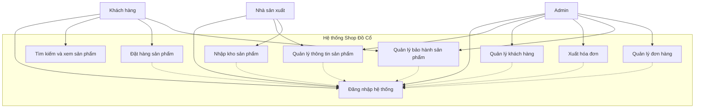
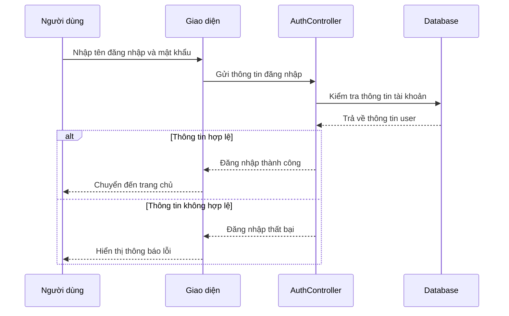
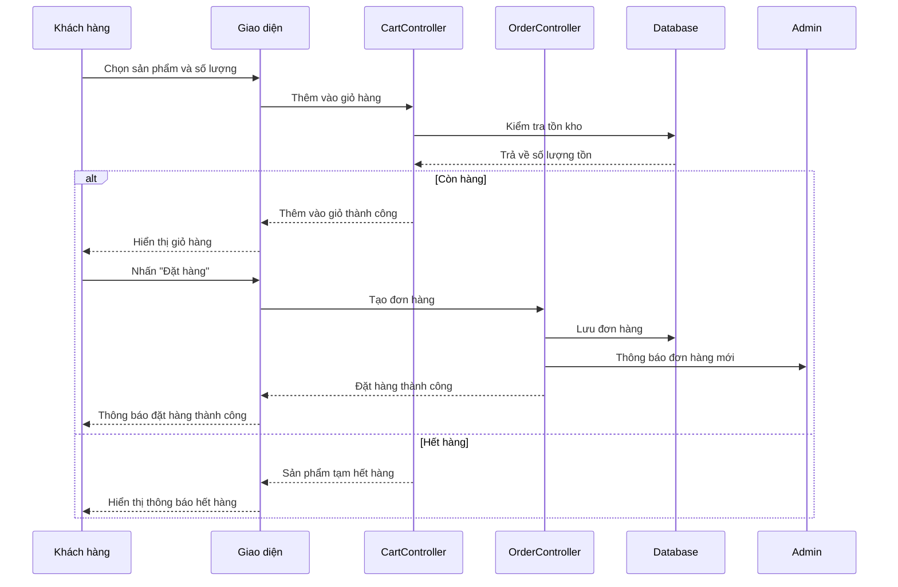
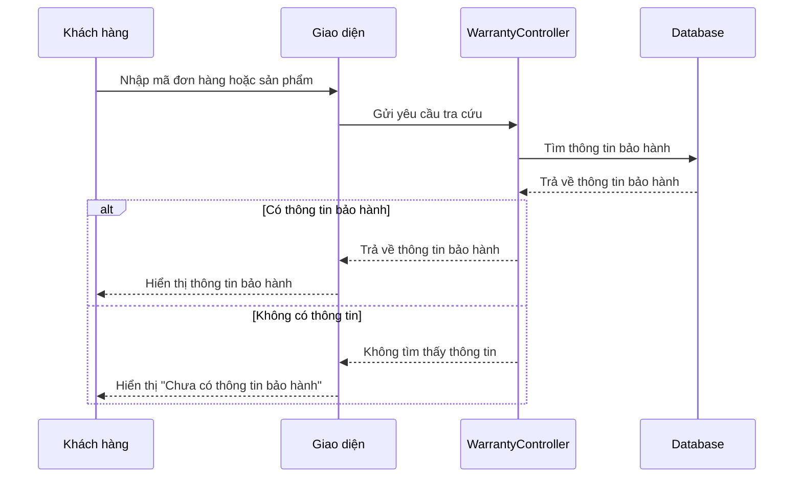
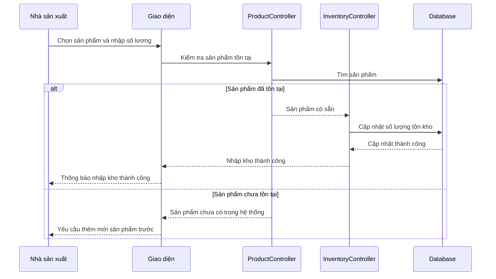
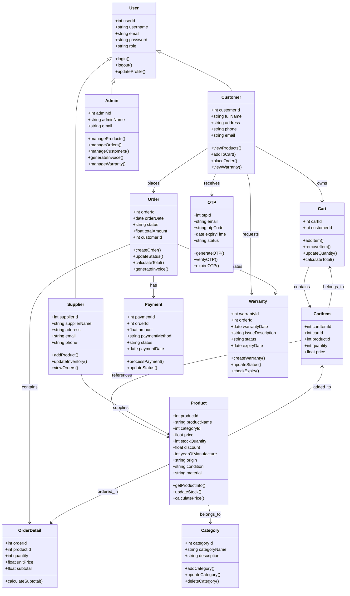
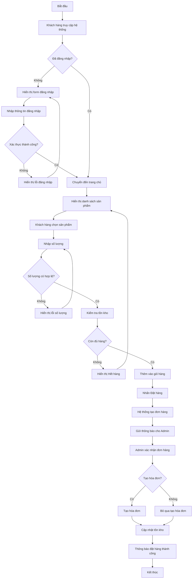
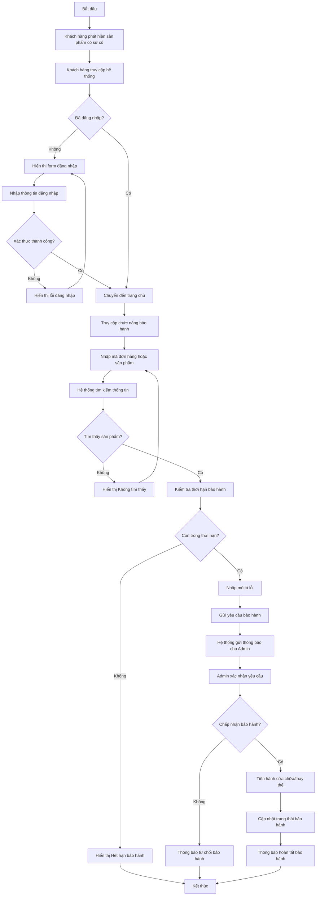
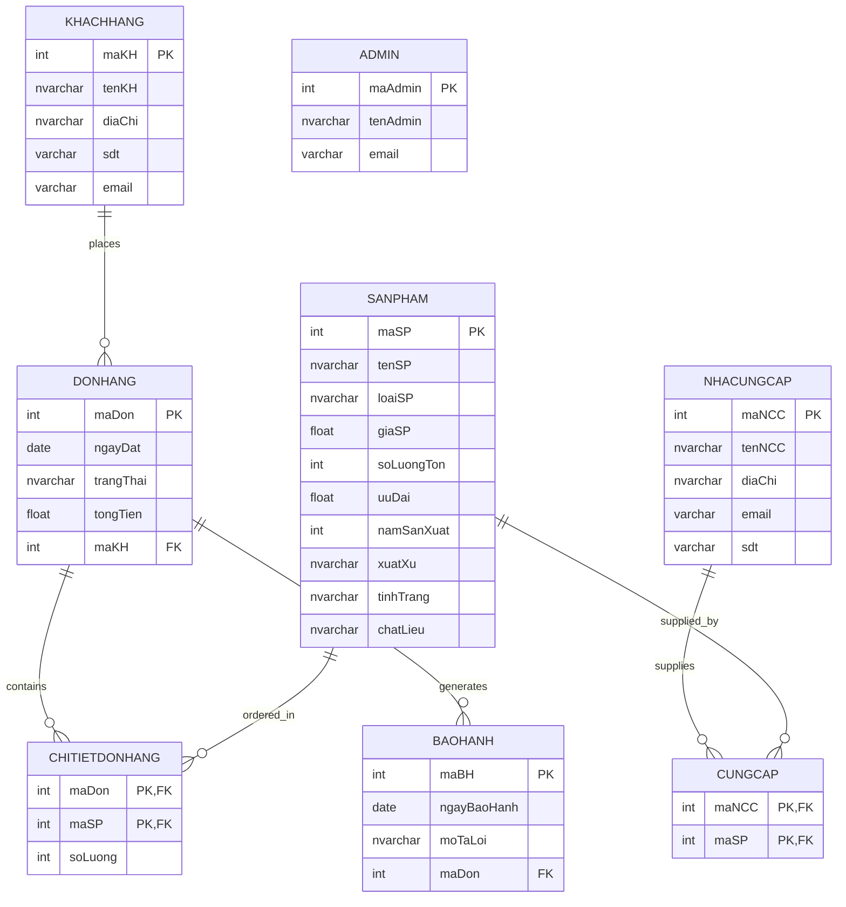

# CHƯƠNG 2: PHÂN TÍCH THIẾT KẾ HỆ THỐNG - SƠ ĐỒ MERMAID

## 2.2. SƠ ĐỒ USECASE CHÍNH

### Hình 2-1: Sơ đồ usecase chính

## 2.3. SƠ ĐỒ TUẦN TỰ (SEQUENCE DIAGRAMS)

### Hình 2-2: Sơ đồ tuần tự Đăng nhập

### Hình 2-3: Sơ đồ tuần tự đặt mua sản phẩm

### Hình 2-4: Sơ đồ tuần tự tra cứu thông tin bảo hành

### Hình 2-5: Sơ đồ tuần tự quản lý nhập kho sản phẩm

## 2.3. SƠ ĐỒ LỚP TỔNG QUÁT

### Hình 2-6: Sơ đồ lớp tổng quát của hệ thống

## 2.4. SƠ ĐỒ HOẠT ĐỘNG (ACTIVITY DIAGRAMS)

### Hình 2-7: Sơ đồ tổng quát mua một sản phẩm

### Hình 2-8: Sơ đồ tổng quát bảo hành một sản phẩm

## 2.5. SƠ ĐỒ CƠ SỞ DỮ LIỆU QUAN HỆ

### Hình 2-10: Mô hình cơ sở dữ liệu quan hệ

## HƯỚNG DẪN SỬ DỤNG:

1. **Copy từng đoạn code Mermaid** ở trên
2. **Paste vào các công cụ hỗ trợ Mermaid** như:
   - Mermaid Live Editor: https://mermaid.live/
   - GitHub (trong file .md)
   - VS Code với extension Mermaid
   - Notion, Obsidian, etc.

3. **Mỗi sơ đồ mô tả**:
   - **Use Case**: Các chức năng và người dùng của hệ thống
   - **Sequence**: Luồng tương tác giữa các thành phần
   - **Class**: Cấu trúc các lớp và mối quan hệ
   - **Activity**: Quy trình hoạt động chi tiết
   - **ERD**: Mô hình cơ sở dữ liệu quan hệ

## GHI CHÚ:
- Tất cả các sơ đồ đều được tạo dựa trên nội dung báo cáo Chương 2
- Các sơ đồ có thể được chỉnh sửa để phù hợp với yêu cầu cụ thể
- Mỗi sơ đồ đều có tiêu đề và số thứ tự theo báo cáo gốc
